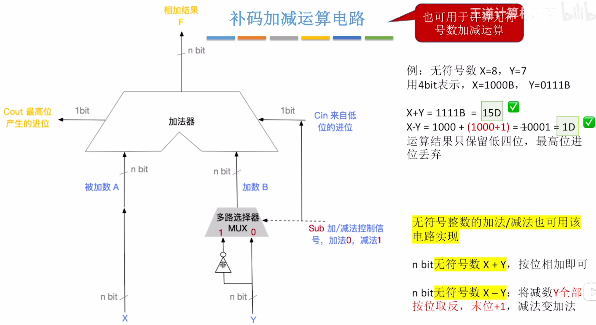

---
tags:
  - 计算机组成原理
---
# 加法运算
- 同有符号数相同
# 减法运算
- 核心还是==减法变加法==
- 将减数转换为它的补数
- 例如8bit的无符号数，就相当与计算机会天然的进行mod256的操作
- 那么一个数，与它的补数满足，它+它的补数=256
- 将这个数按位取反得到$x_反$那么有$x+x_反=8个1，即255$那么$（x_反+1）+x=256$所以$x_反+1$就是它的补数，

# 溢出判断
这就是带标志位加法器里CF的原理
CF里判断异或是用$C_{out} \oplus C_{in}$

- 在加法时，多路选择器的控制信号会是0，也就是$C_{in}$是0，然后溢出时是看==最高位产生的进位==也就是$C_{out}$，如果$C_{out}=1$，表示发生溢出
- 在减法时，多路选择器的控制信号会是1，$C_{in}$是1，此时如果==最高位产生的进位==$C_{out}=0$,表示发生溢出
---
# 总结CF与无符号数加减运算的关系
- $$CF=C_{out} \oplus C_{in}$$
- $C_{out}$其实就是补码加减运算电路中==最高位的进位==
- 加法溢出$$C_{in}=0,C_{out}=1$$
- 减法溢出$$C_{int}=1,C_{out}=0$$
- 所以溢出判断就是$$C_{in} \oplus C_{out}$$
