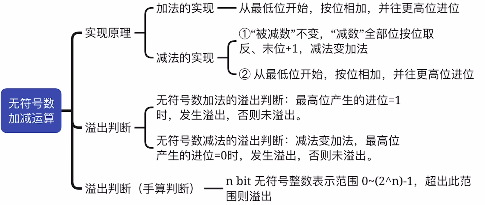
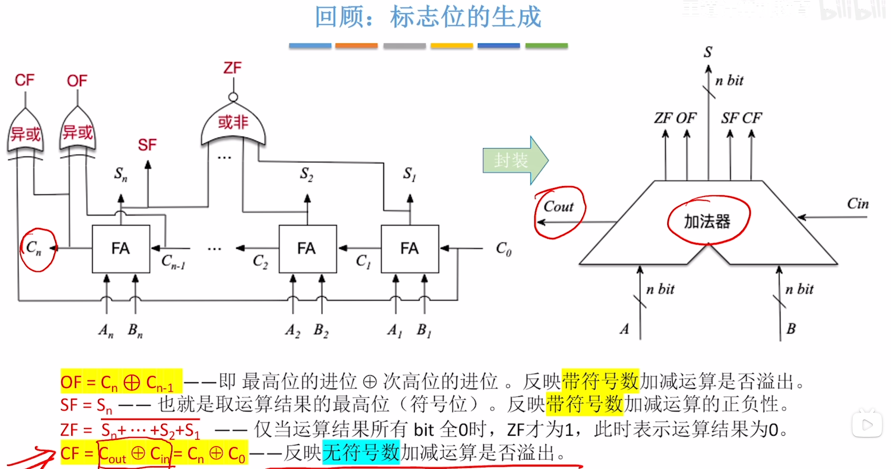
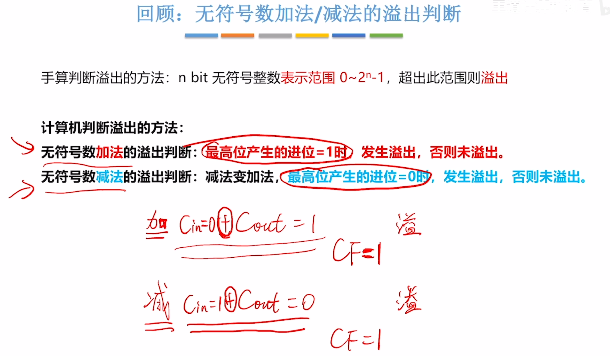

---
tags:
  - 计算机组成原理
---
# 加法运算
- 同有符号数相同
# 减法运算
- 核心还是==减法变加法==
- 将减数转换为它的补数
- 例如8bit的无符号数，就相当与计算机会天然的进行mod256的操作
- 那么一个数，与它的补数满足，它+它的补数=256
- 将这个数按位取反得到$x_反$那么有$x+x_反=8个1，即255$那么$（x_反+1）+x=256$所以$x_反+1$就是它的补数，

# 溢出判断
这就是带标志位加法器里CF的原理
CF里判断异或是用$C_{out} \oplus C_{in}$

在加法的溢出判断时，如果是正数