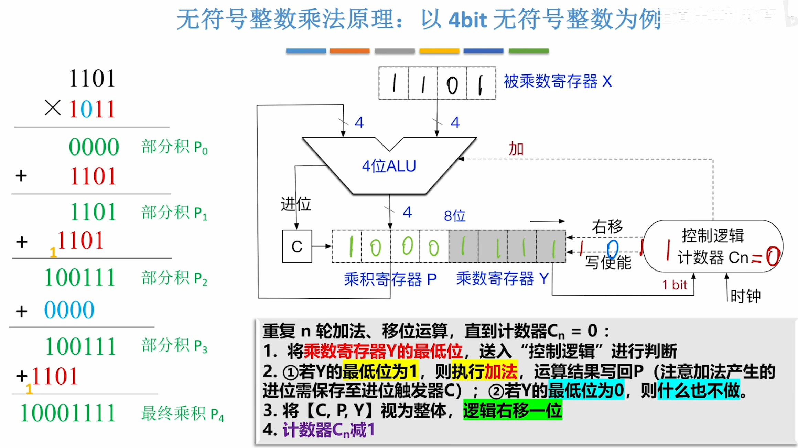
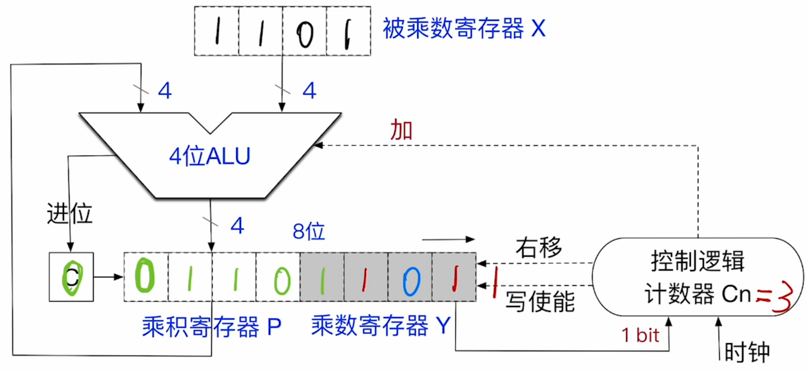
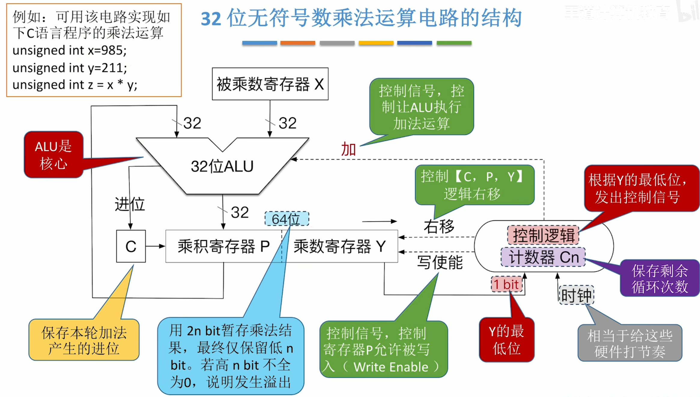

---
tags:
  - 计算机组成原理
---
- 概念：由**ALU，移位器，寄存器，控制逻辑**组成的乘法电路
---

- 计数器$C_n$表示乘数和被乘数的位数。(n位二进制乘以n位二进制结果最多有2n位)
- C表示进位
- 将乘法转换成多个加法，根据乘数的1的个数，绝对了要加几次被乘数（1101），关键就是进行加法的时候会根据当前的进行到乘数的第几位来决定相加的错位[逻辑右移](408/定点数的移位运算%201.md#逻辑右移)，如图所示。初始让部分积P0=0，也就是乘积寄存器P一开始为0000
- 乘数寄存器一开始为1011
- 第一次加法，因为Y的最低位是1，所以执行加法，看图片中P和X的线路，意思就是，将P里的数和X里的数相加，结果再赋值回P
- 第一次加后的结果
- 
- 为了使下次相加能实现错位的效果，将C,P,Y整体右移
- 
- 其中C空出来补0
- 下次加法的时候
- 0 1 1 0
- 1 1 0 1
- 就可以实现错位的效果
---
1. 最后运算的结果用2n位暂存（寄存器P，寄存器Y）
2. 但是在很多计算机架构中，通常只保留低n位作为乘积结果，因此，运算结果可能发生==溢出==
