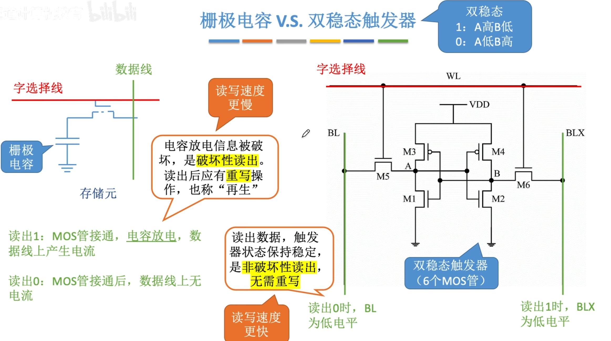
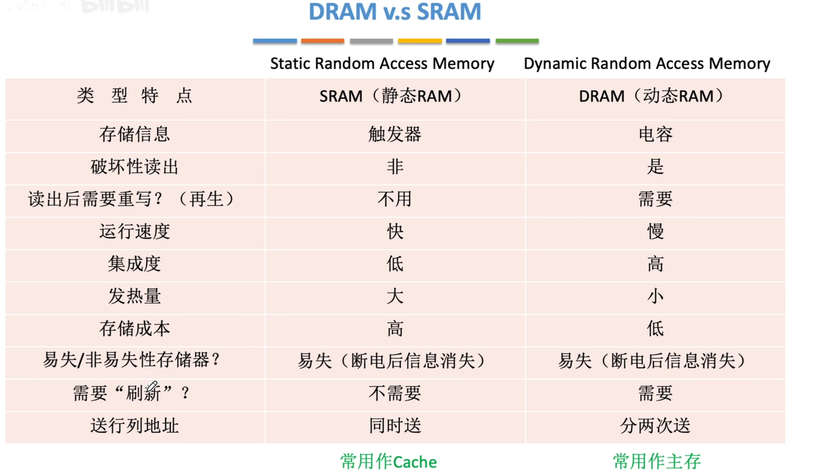
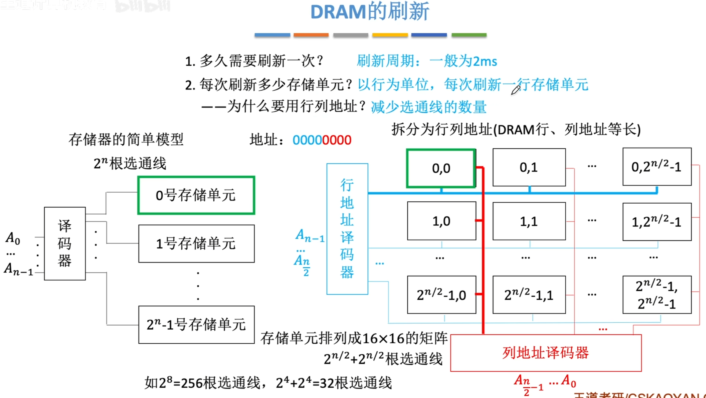
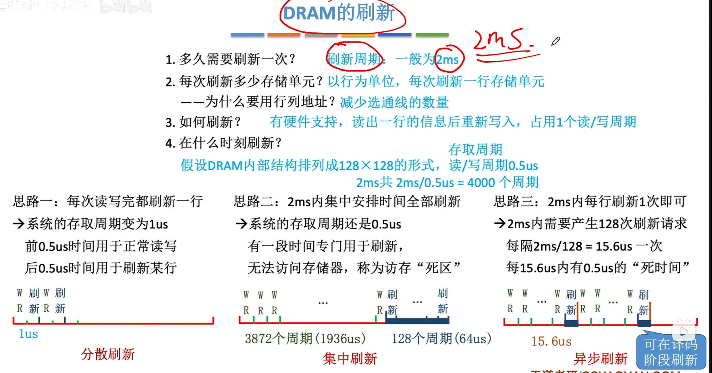

---
tags:
  - 计算机组成原理
---

%%栅极电容,双稳态触发器图%%
- SRAM的存储元基于双稳态触发器
- DRAM的存储元基于栅极电容

%%DRAM,SRAM对比表格%%
>栅极电容内的电荷只能维持2ms,即使不断电,2ms后信息也会消失
>双稳态触发器只要不断电,触发器的状态就不会改变

## DRAM的刷新

### DRAM的三种刷新策略

>刷新一次相当于一次读/写,占用一个读/写周期