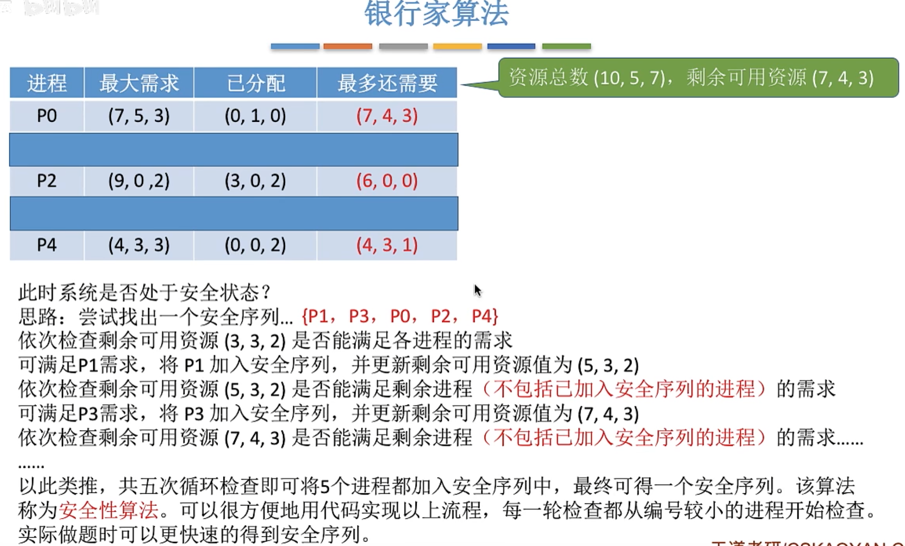
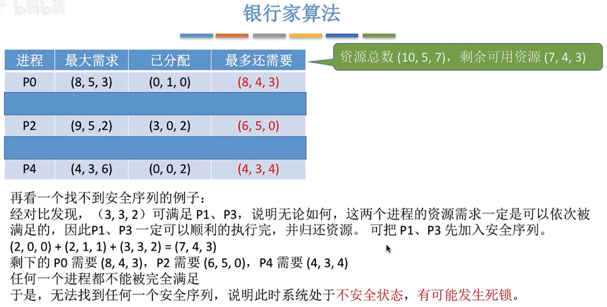

---
tags:
  - 操作系统
---
# 预防死锁
## 破坏互斥条件

## 破坏不剥夺条件

## 破坏请求和保持条件

## 破坏循环等待条件

---

# 避免死锁
## 银行家算法

### 安全性算法

>通过逐次循环比较，可以得到将所有进程都包含的安全序列。说明系统处于安全状态
#### 手算安全序列

>不用逐次循环比较，只要满足当前资源需求的就可以直接同时加入安全序列
#### 找不到安全序列的例子

## 银行家算法流程

