---
tags:
  - 计算机组成原理
---
# 用汇编语言描述数据在什么地方

## mov指令为例

- `dword ptr`双字，指明读写长度
- `word ptr`单字
- `byte ptr`字节

## x86架构的寄存器

>看到E,表示这是个寄存器且长度是32位
>通用寄存器都是X结尾，变址寄存器都是I结尾，堆栈寄存器都是P结尾

### 通用寄存器可以更灵活的使用
#### 只使用低16bit的空间

#### 只使用低8bit的空间

## 常见的例子

# 常见的指令
## 常见算术指令

>x86规定两个操作数不能同时来自于主存
>除法指令时，只给了一个操作数s作为除数，实际上被除数隐含在了edx:eax中
>写成edx:eax是因为在除法执行之前，会对被除数进行扩展，32位除以32位会变成64位除以32位。而e开头的寄存器只能存32位数据，所以要两个寄存器也就是写成edx:eax

## 常见逻辑运算指令

# AT&T格式

# 选择语句的机器级表示
#### 无条件转移
- 
- 
## 条件转移指令

选择语句示例

或者换一种写法
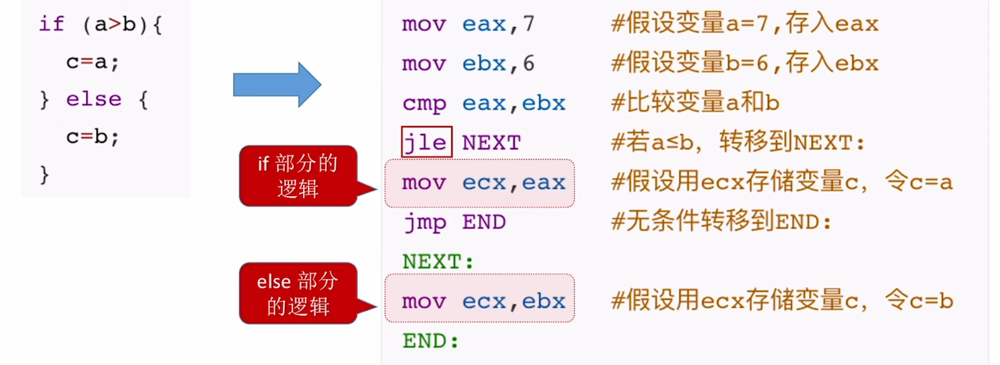
真题内的选择语句
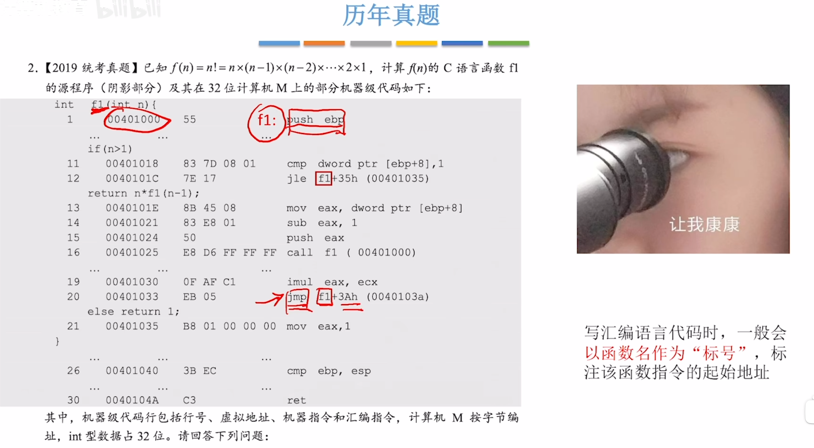
>f1并不是16进制数，f1是函数名，函数名一般会作为标号，也就是函数第一条指令的地址（00401000）

#### CMP指令的底层原理
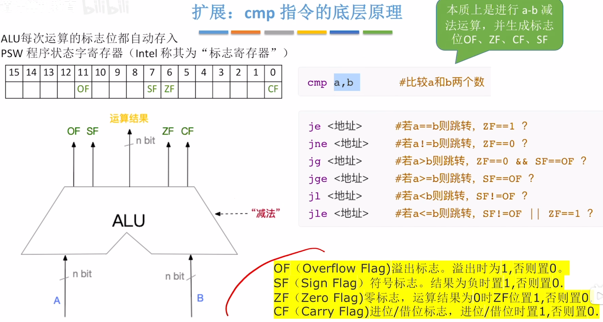

# 循环语句的机器级表示
## 用条件转移指令实现
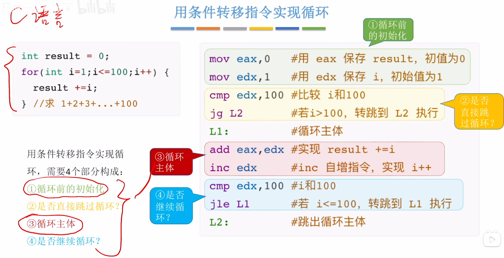
## 用LOOP指令实现
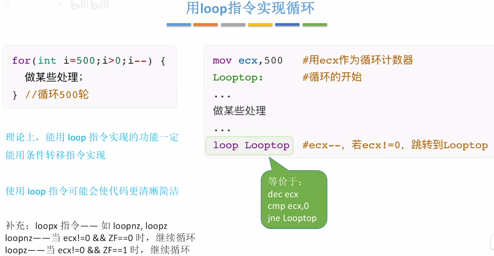
>loop与寄存器ecx是搭配使用的，使用loop必须配合使用ecx，不能使用其他寄存器作为循环计数器
>loopx指令，除了判断`ecx != 0`之外，还会多一个判断条件，通常是看C语言部分反推

# 过程调用的机器级表示
## 函数调用
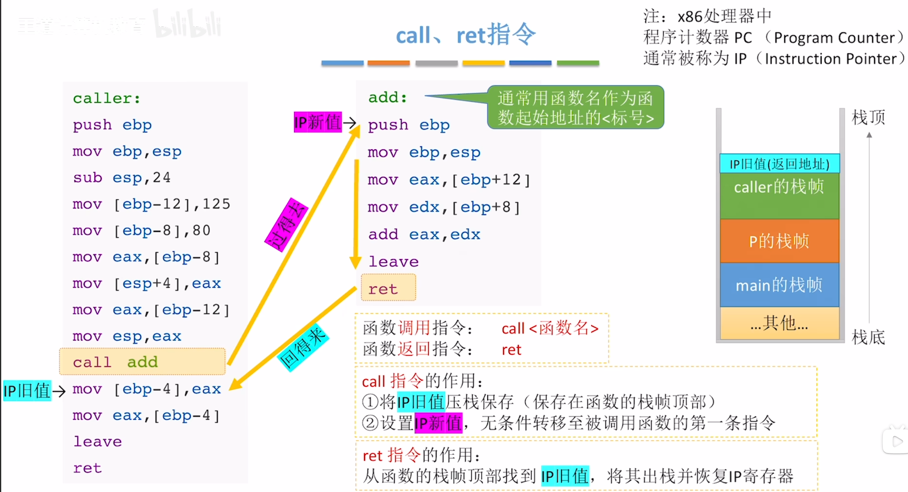
### 函数调用栈
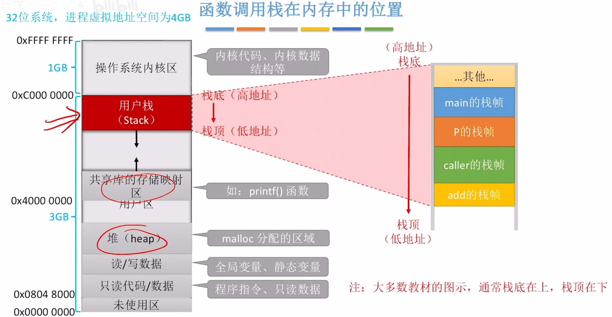
#### 标记栈帧范围
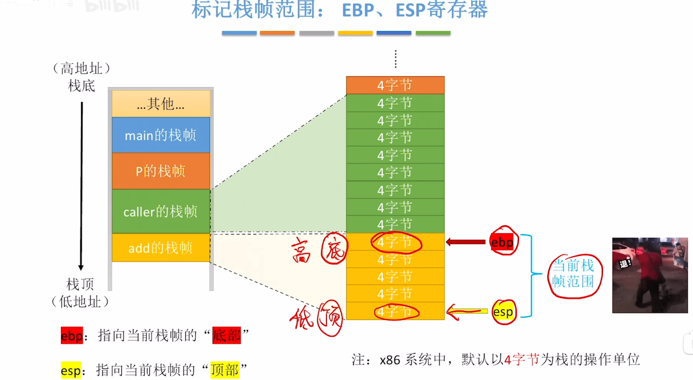
>这两个寄存器存储的是两个内存地址
>对栈帧内数据的访问，都是基于ebp、esp进行的

#### 访问栈帧数据
两种方法
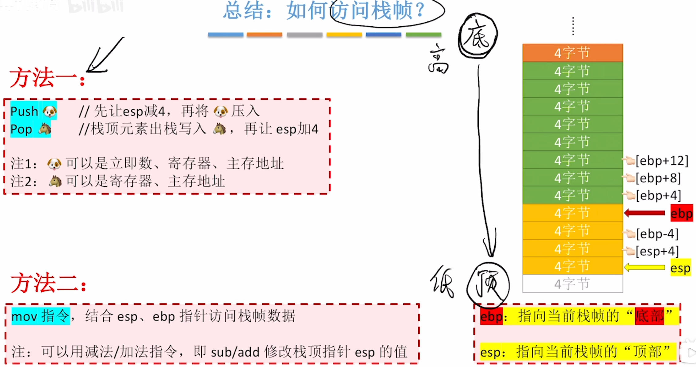

通过push，pop指令结合寄存器ebp，esp访问
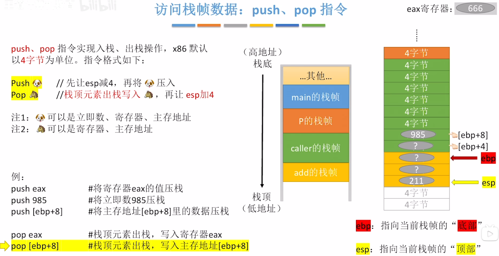

通过mov指令访问
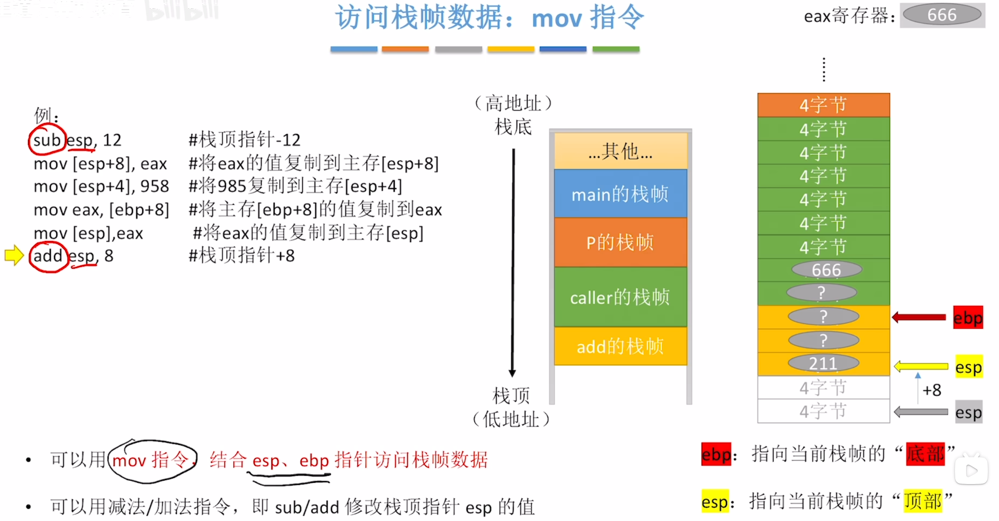
### 切换栈帧
#### 函数调用时
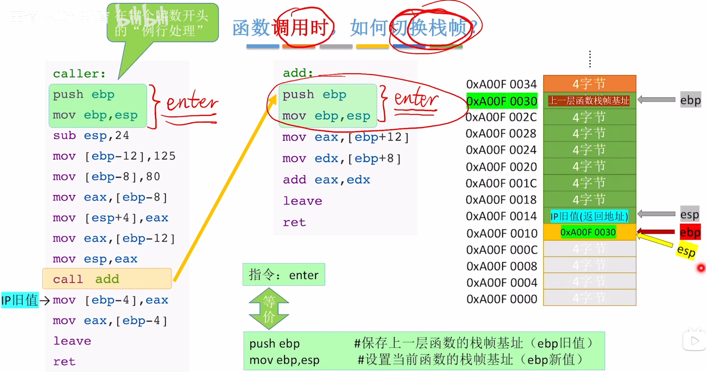
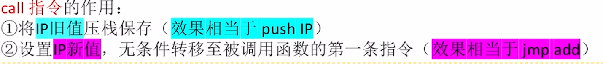
%%call指令的作用%%
>绿色部分是caller函数的栈帧
>先执行call，再执行push，mov
>每个函数的栈帧底部都保存着上一个函数的栈帧基地址（ebp里存的是地址）

#### 函数返回时
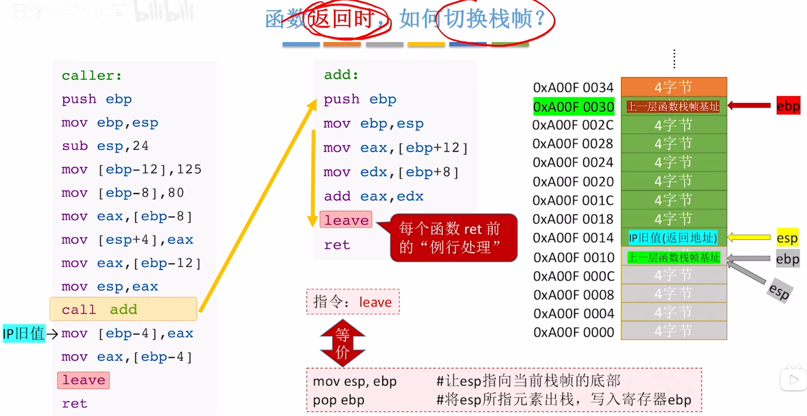
>执行这两条指令,ebp,esp就能回到上一个函数的栈帧
>pop指令让esp指向的值存入ebp内，然后esp+4，esp此时指向的值就是上一层函数的栈帧基址，所以ebp就会定位到上面去了

**ret**指令：在call指令的时候，已经在栈帧的顶部存了返回地址
**从函数的栈帧顶部找到IP旧址，将其出栈并恢复IP寄存器**
### 总结
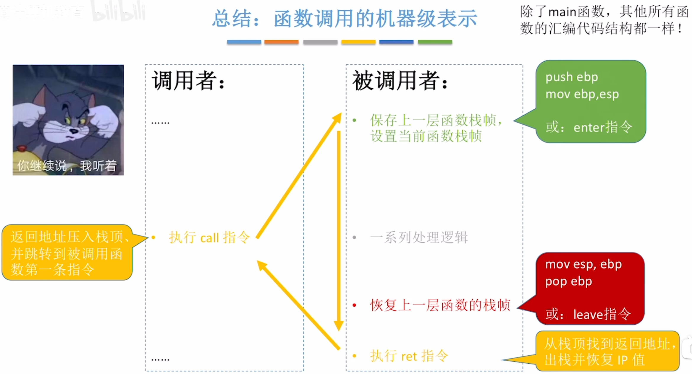

## 栈帧内的内容
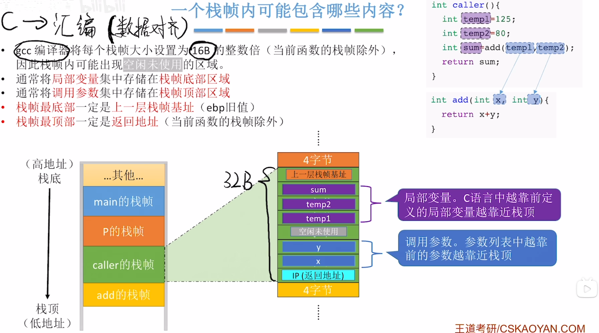
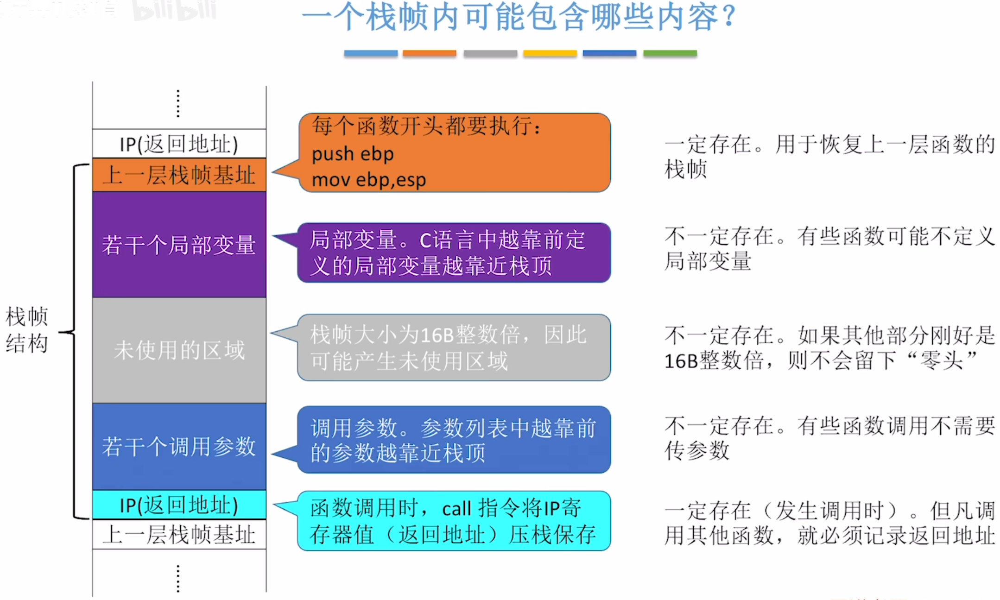
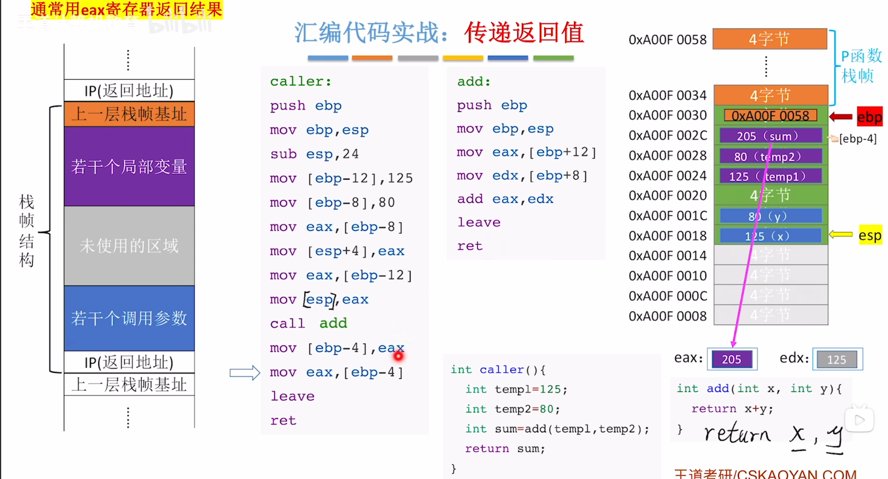
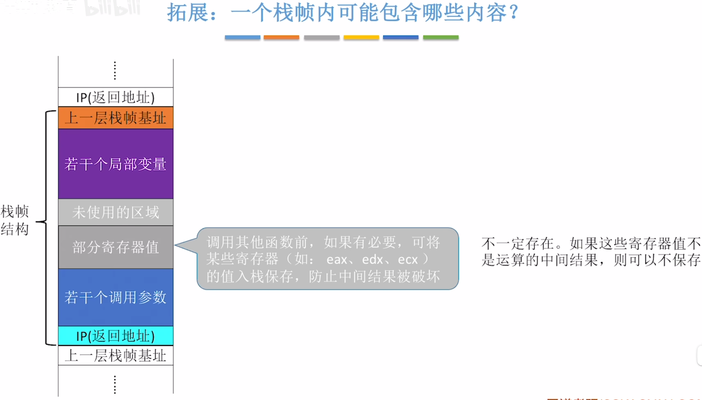