---
tags:
  - 计算机组成原理
---
# 用汇编语言描述数据在什么地方
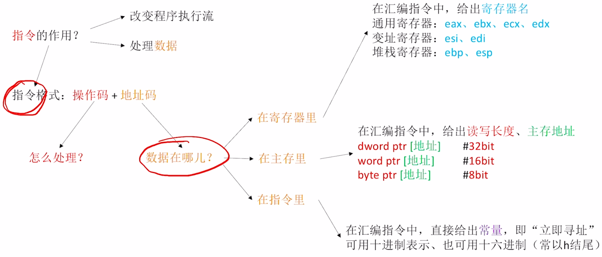
## mov指令为例
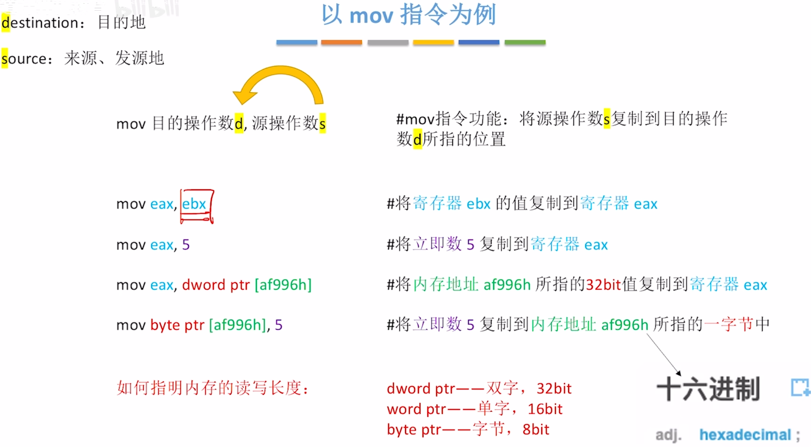
- `dword ptr`双字，指明读写长度
- `word ptr`单字
- `byte ptr`字节

## x86架构的寄存器
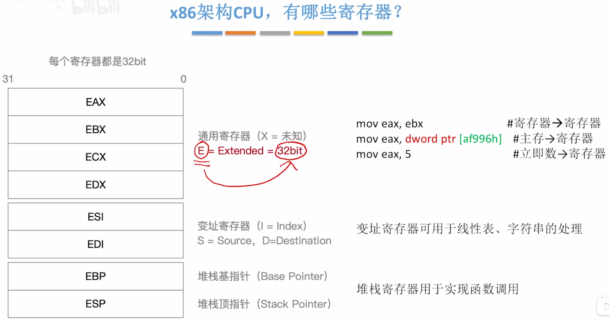
>看到E,表示这是个寄存器且长度是32位
>通用寄存器都是X结尾，变址寄存器都是I结尾，堆栈寄存器都是P结尾

### 通用寄存器可以更灵活的使用
#### 只使用低16bit的空间
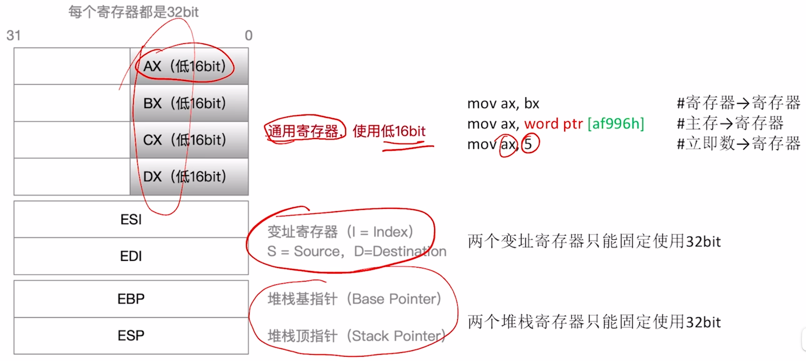
#### 只使用低8bit的空间
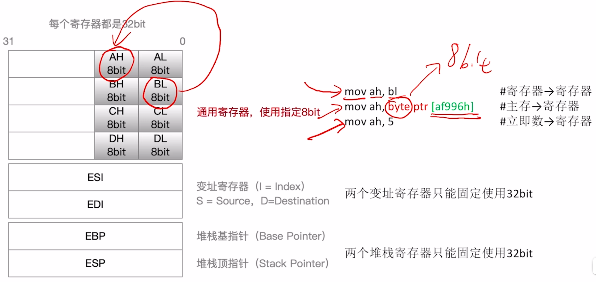

## 常见的例子
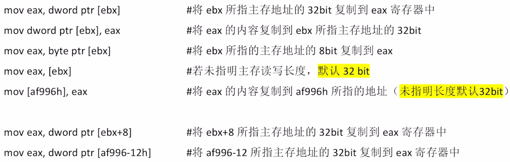

# 常见的指令
## 常见算术指令
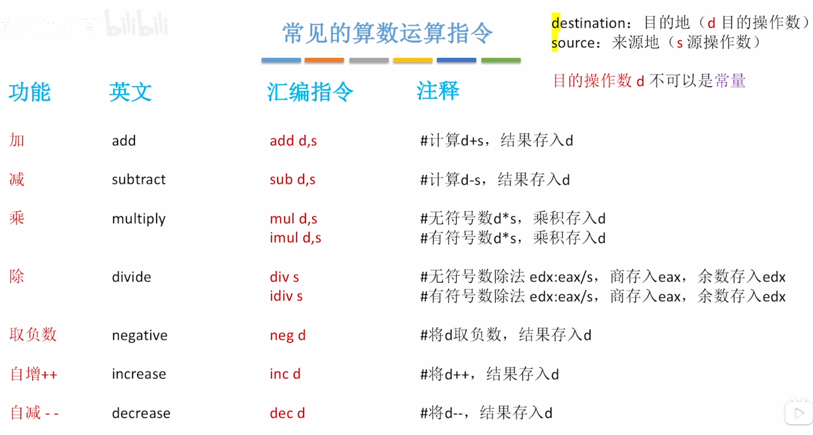
>x86规定两个操作数不能同时来自于主存
>除法指令时，只给了一个操作数s作为除数，实际上被除数隐含在了edx:eax中
>写成edx:eax是因为在除法执行之前，会对被除数进行扩展，32位除以32位会变成64位除以32位。而e开头的寄存器只能存32位数据，所以要两个寄存器也就是写成edx:eax

## 常见逻辑运算指令
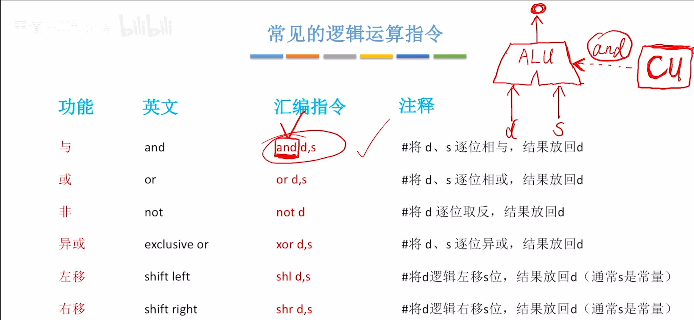

# AT&T格式
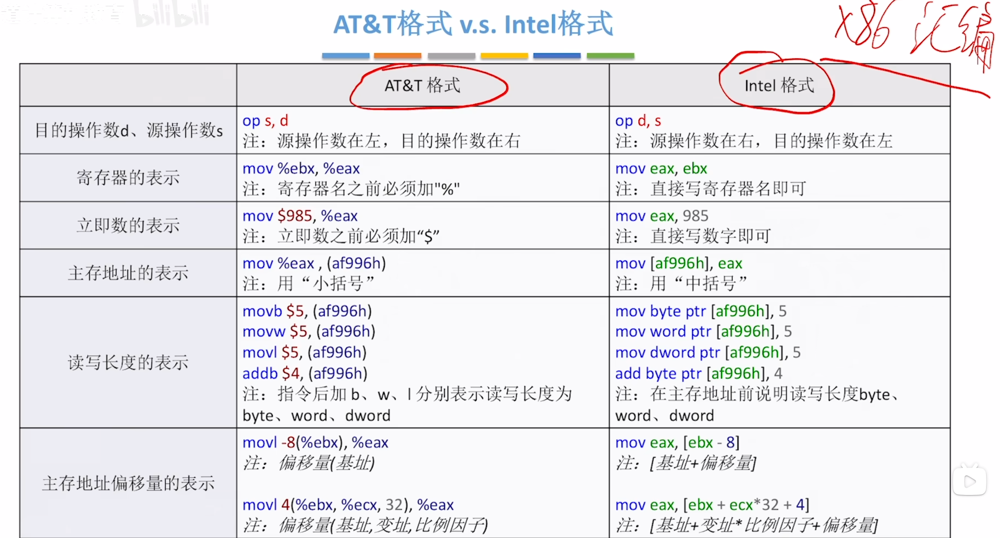

# 选择语句的机器级表示
#### 无条件转移
- 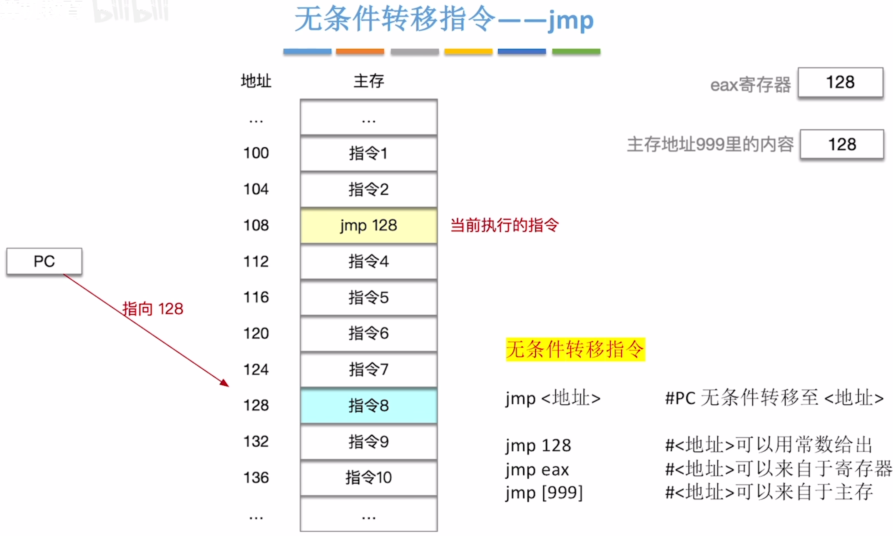
- 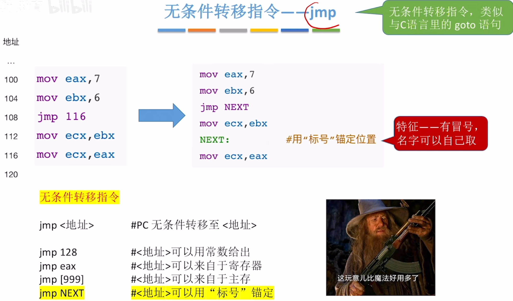
## 条件转移指令
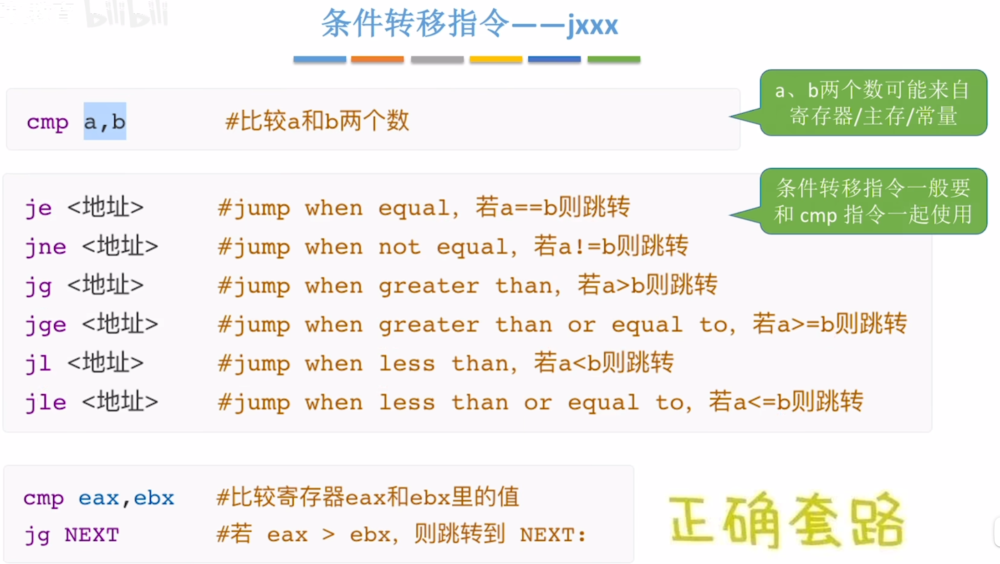

选择语句示例
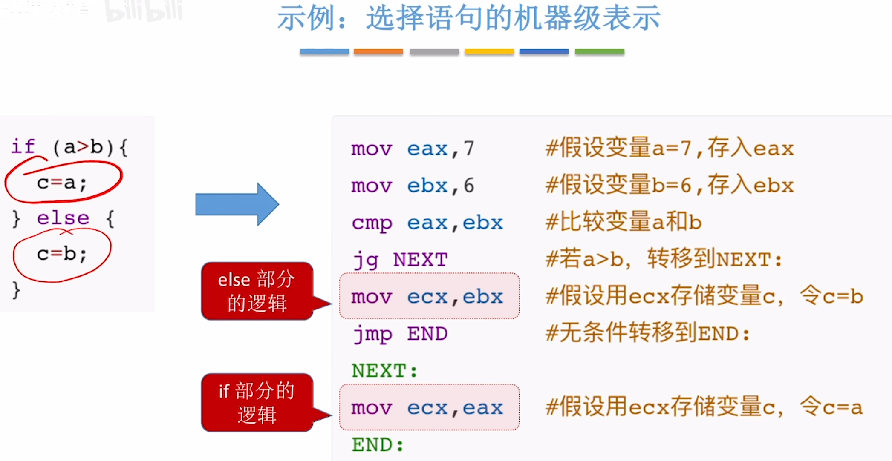