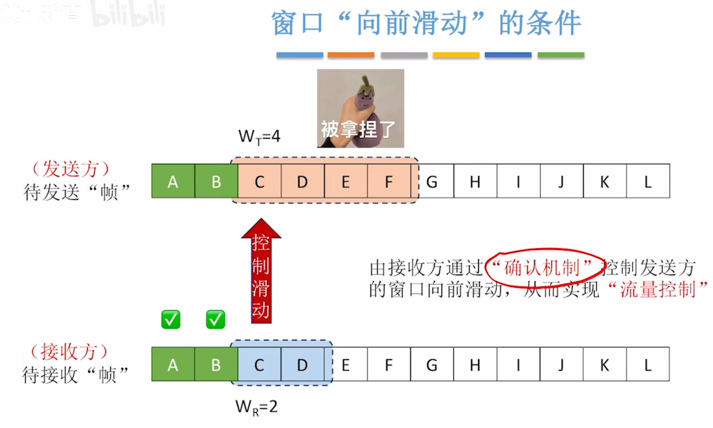
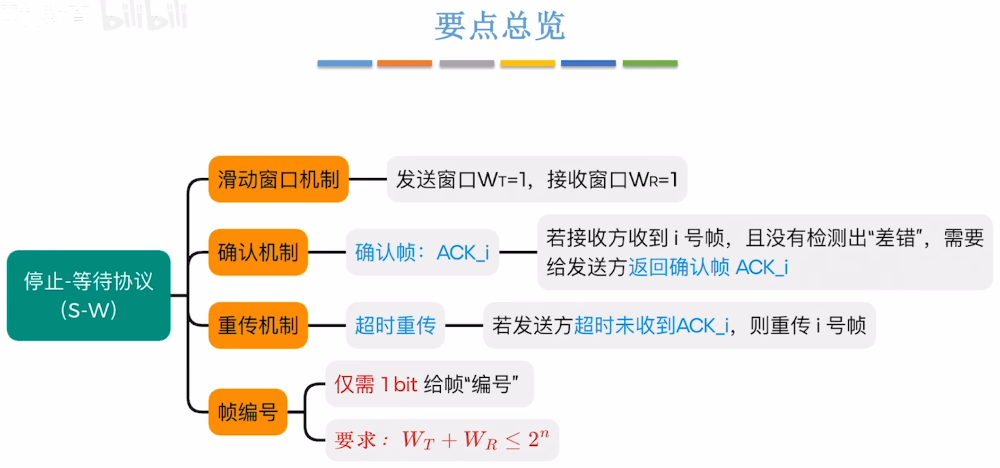
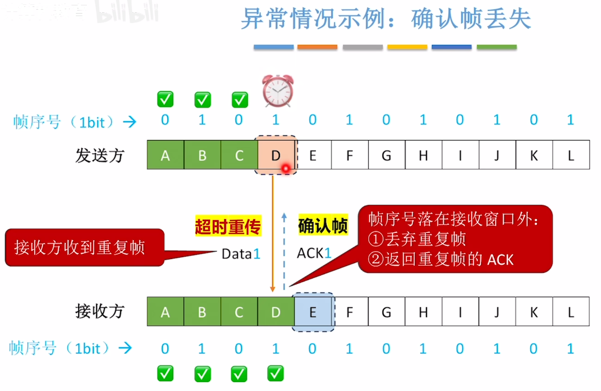

---
tags:
  - 计算机网络
---

# 滑动窗口机制

>

# 停止-等待协议（S-W）

>帧编号要求：发送窗口+接收窗口 $\le 2^n$n表示用n个bit对帧进行编号，在停止等待协议里，n=1

## 数据帧，确认帧，帧序号的概念

## 正常情况

>发送方发出数据帧，接收方接收到数据帧后发送确认帧然后接收窗口移动一格，等待下一个帧，发送方接收到确认帧，接着发送窗口移动一格，发送下一个帧

## 异常情况
### 数据帧丢失

### 确认帧丢失

