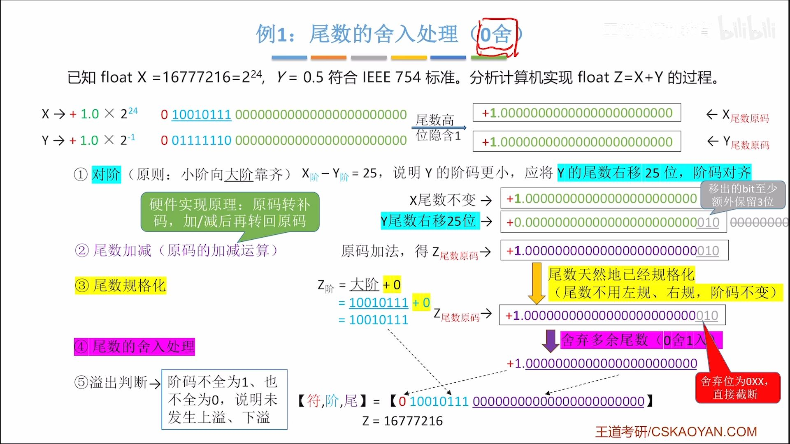
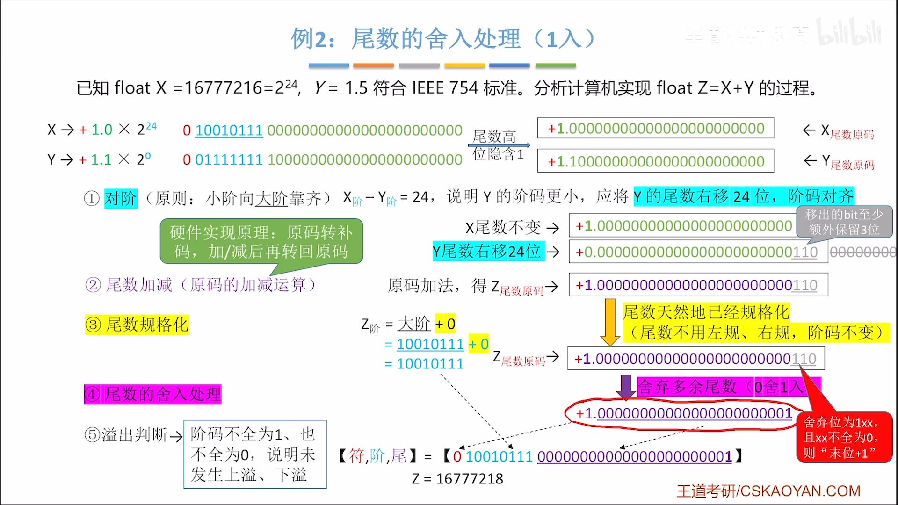
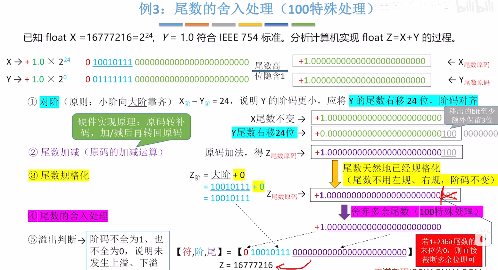

# 尾数的0舍

> 运算结果里，预定要被舍弃的三位（小数点后面第24,25,26位）010里，最高位是0，所以直接舍弃，不进位

# 尾数的1入

>在运算结果里，预定要被舍弃的3位110里形式是**1xx,且xx不全为0**
>则将这三位舍弃，并**末位+1**

# 100情况的特殊处理
## 1.尾数末位为0

>预定要舍弃的三位是100，而100的前面一位也就是尾数的末位是0
>这时候直接截断，舍弃多余位即可