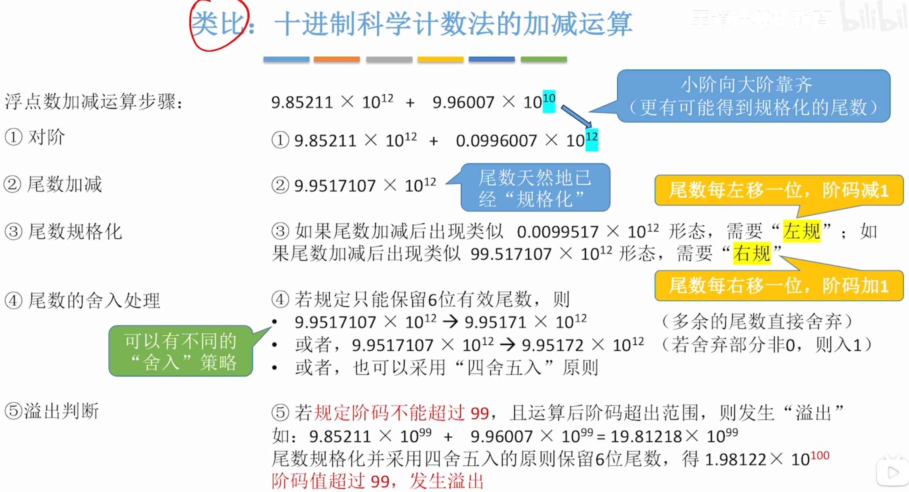
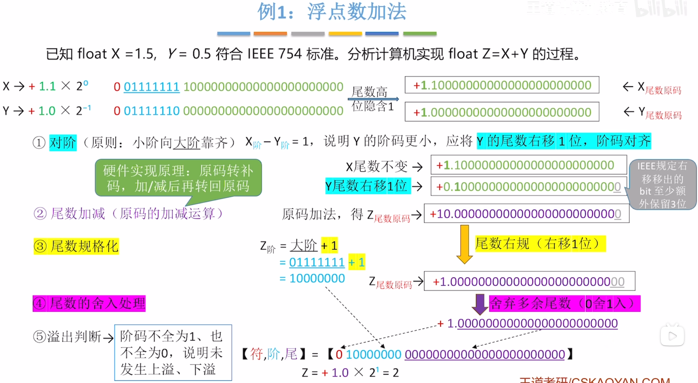
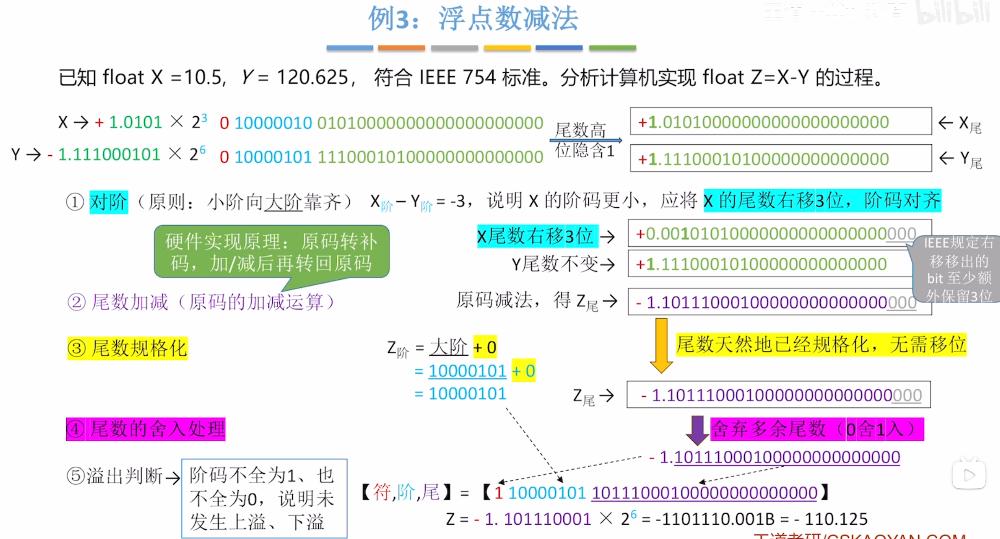

---
tags:
  - 计算机组成原理
---
### 浮点数加减运算类比十进制科学计数法的加减运算

# 浮点数加法

1. 对阶：在计算机内部，是通过X的阶码减去Y的阶码来判断谁的阶码更小的（阶码本身是无符号数，但是做减法时，是当做有符号数来解读，这样在能看出正负才能比较大小）
	1. 阶码小的进行尾数右移，让阶码变大
2. 尾数加减：尾数加减这里都是正数所以原反补相同，在计算机内部进行原码的加减运算时本质就是将原码转为补码进行运算后再转回原码
3. 尾数规格化：图片里是将尾数右规一位，也就是阶码要增加1
4. 尾数的舍入处理：0舍1入，如果被舍弃的数的最高位是1，则考虑向更高位入一个1，若是0，则直接舍弃
5. 溢出判断：不符合规格化浮点数的要求（阶码不全为1或0）
# 浮点数减法

>容易出错的地方：在算x-y时，写出他们的二进制原码,包含隐藏的1，
>0.001010100
>1.111000101
>然后要将他们转换成原码进行减法，一定要注意，要在**高位加一个1表示符号**
>==0==0.001010100(x补)
>==0==1.111000101(y补)
>因为是减法，要把y补转换成补数（全部位取反+1）