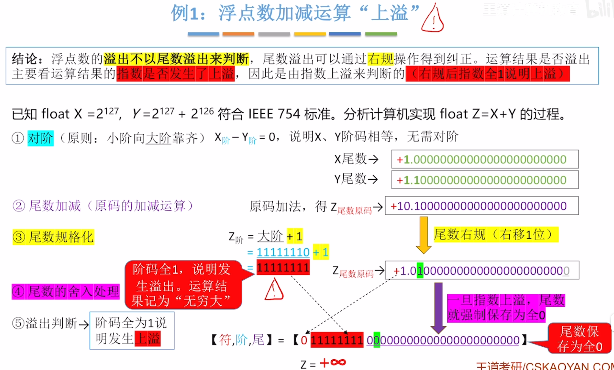

---
tags:
  - 计算机组成原理
---
在进行[浮点数的加减运算](408/浮点数的加减运算.md)时可能发生溢出
# 浮点数加减运算上溢

>计算之后的结果不符合规格化浮点数，对其进行右规。
>右规之后阶码+1，可是阶码+1之后变成了全1
>此时会将尾数强制保存为全0
>这时候阶码为1，尾数全为0，符号位是0，表示无穷大[特殊状态的浮点数](408/特殊状态的浮点数.md).
>**浮点数的溢出不以尾数溢出来判断，尾数溢出可以通过右规操作得到纠正。运算结果是否溢出主要看运算结果的指数（阶码）是否发生了上溢，因此是由指数上溢来判断的（右规后指数全1说明上溢）**