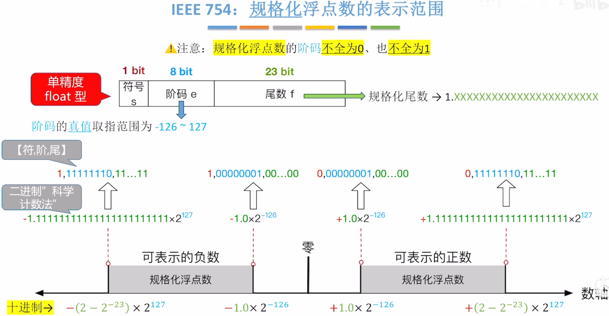
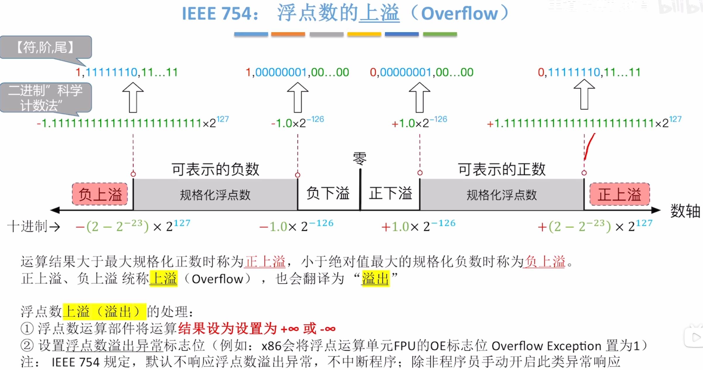
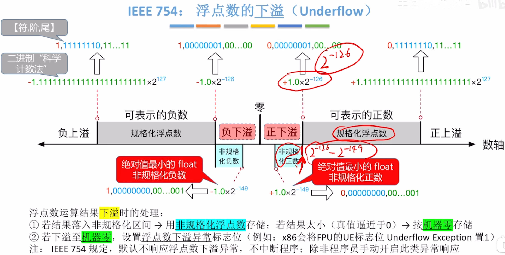
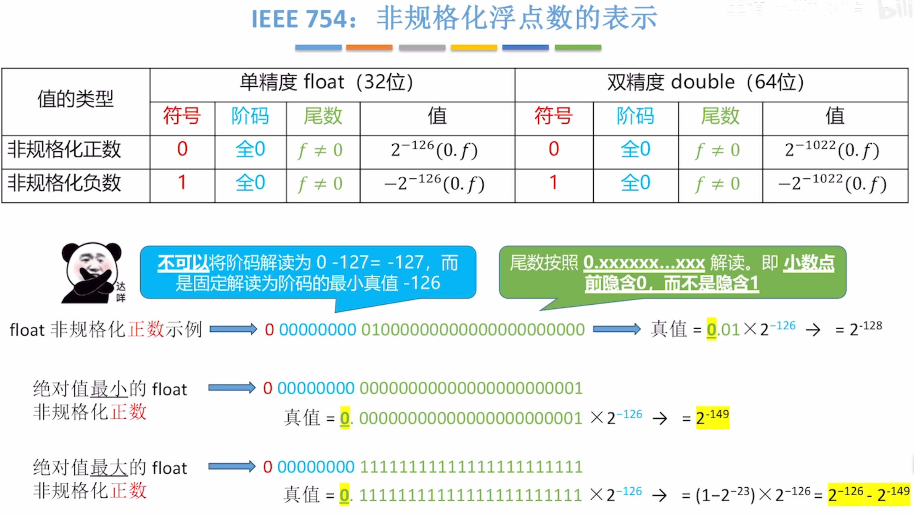

---
tags:
  - 计算机组成原理
---
# 规格化浮点数的表示范围

>阶码是八位无符号数，本来是可以表示0到255，但是因为是==规格化浮点数，阶码不全为0，也不全为1==所以表示范围就变成了1到254，1到254减去偏置值127,得到真值取值范围是-126~127

>规格化浮点数限制的是**阶码不是尾数**
>绝对值最大的正数和负数：让尾数全为1，阶码取最大的真值127得到
>绝对值最小的正数和负数：让尾数全为0，阶码取最小的真值-126得到(别忘了小数点前隐含的1)

>正数最大是$2-2^{-23}\times 2^{127}$是因为1.11....111加上0.00....001就得到10.00...00。10.00....00就是2，而0.00....001是$2^{-23}$所以1.11...111就是$2-2^{-23}$

# 浮点数的上溢

> 看红色的区间，如果两个数相加大于了规格化浮点数所能表示的最大数值（$2-2^{-23}\times 2^{127}$）此时称为**上溢**，此时将会把结果设置为$+\infty$（这是一个[特殊状态的浮点数](特殊状态的浮点数.md)（阶码全0，尾数全0，符号位为0））。下溢同理，只是变符号

>溢出时会将浮点数溢出异常标志位（OE）置为1

# 浮点数的下溢

>注意：产生下溢时，若结果还没有逼近0，是采用非规格化浮点数存储，是一个**区间**所以有绝对值最小的float非规格化正数和绝对值最大的float非规格化正数

## 非规格化浮点数的表示

>非规格化浮点数：阶码全0，尾数不全为0
>注意阶码的解读不能按照规格化浮点数那样解读（看成无符号数转为真值再减去偏置值）

>绝对值最小的float非规格化正数：对应非规格化正数区间的左端点，

