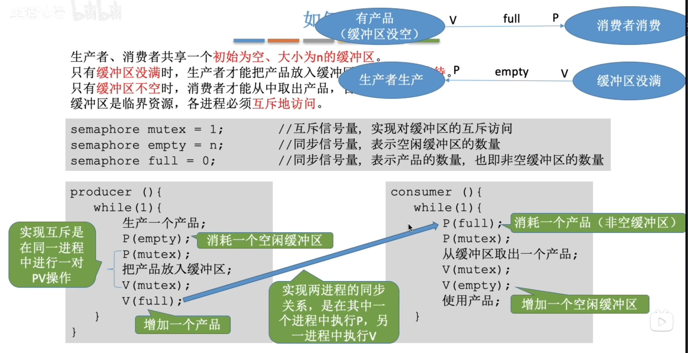
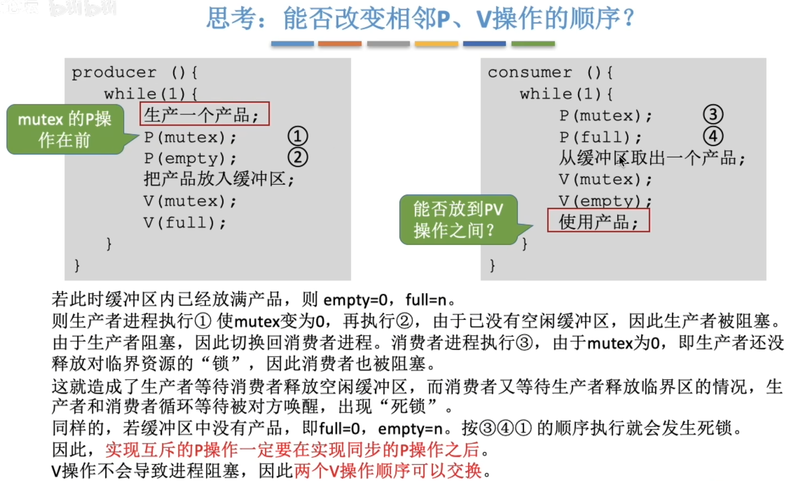
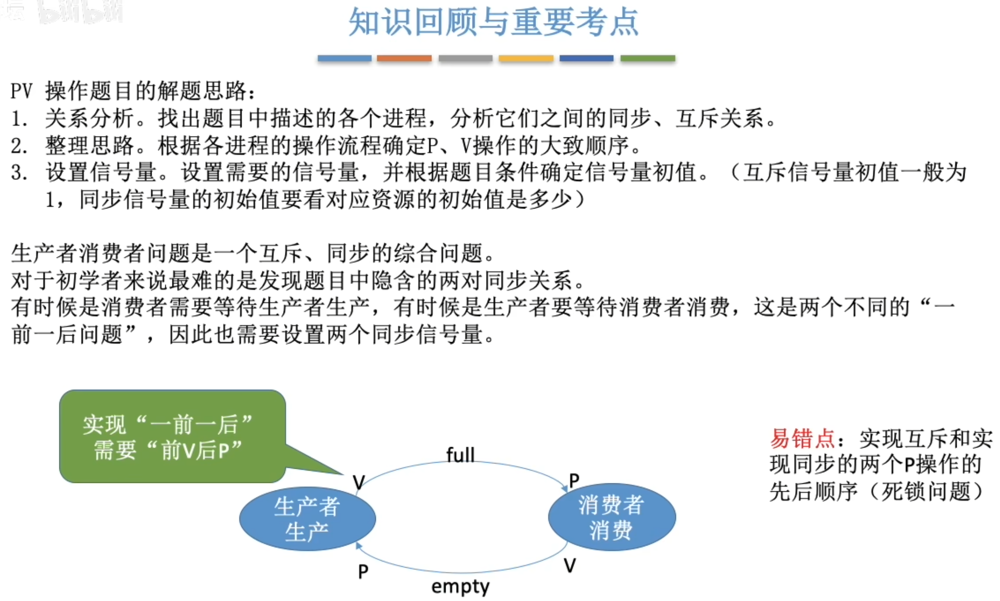

---
tags:
  - 操作系统
---

>对于消费者，full这个信号量表示的是缓冲区里的产品数量，p表示申请一个产品，所以full初始值为0
>对于生产者，empty这个信号量表示的是缓冲区里空闲的位置的数量，初始缓冲区没有产品，空闲的位置是n

# 具体实现

# 互斥的P要在同步的P之后

>生产产品和使用产品逻辑上可以放在PV操作之间，但是这样会使临界区代码变长，使一个进程对临界区的上锁时间变长。不利于各个进程交替的使用[临界资源](408/临界资源.md)

# 小结
