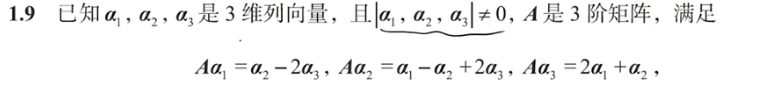

%%P41 1.9%%
遇到像这种列向量线性组合的题目
要把它写成**行向量乘以列向量的形式**
以题目为例
$$\begin{align}
A(\alpha_1,\alpha_2,\alpha_3)&=(A\alpha_1,A\alpha_2,A\alpha_3)\\
&=(\alpha_1,\alpha_2,\alpha_3)\begin{pmatrix}0 & 1 & 2\\ 1 & -1 & 1\\-2 & 2 & 0

\end{pmatrix}
\end{align}
$$