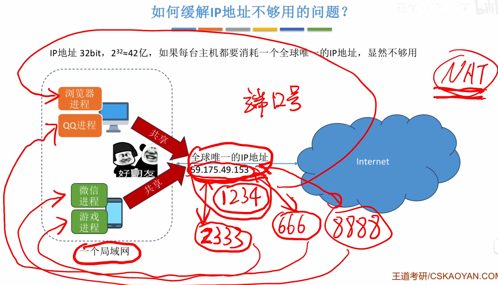

---
tags:
  - 计算机网络
---
# 传输层端口号的概念

>[无连接UDP和面向连接TCP](408/无连接UDP和面向连接TCP.md)

>图里的标注是教学简化，实际 H3 是完整的 IP 数据报首部，IPv4 最少 20 字节，包含的内容远不止源/目的 IP。

# NAT缓解IP地址不够用的思路

>让局域网内的各个主机共享一个IP地址，然后通过IP地址+端口号去映射到某个进程
>一个局域网对外暴露出的IP地址称为外网IP（公网IP）
>
>