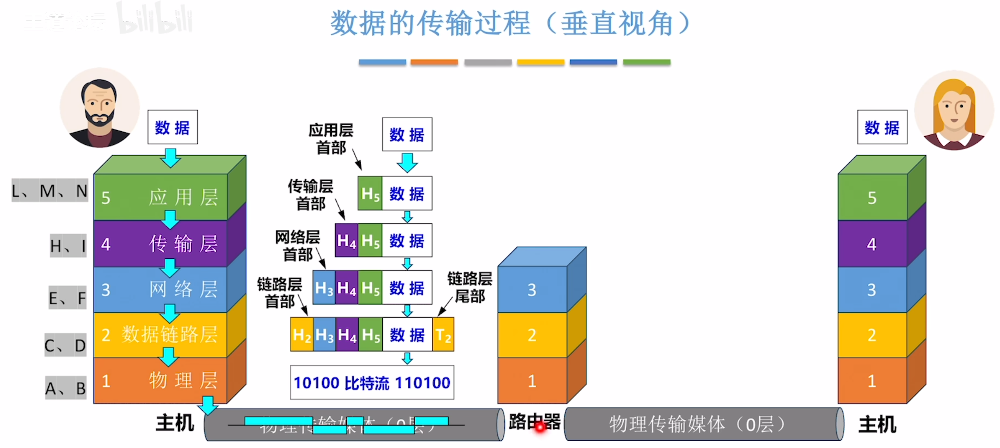
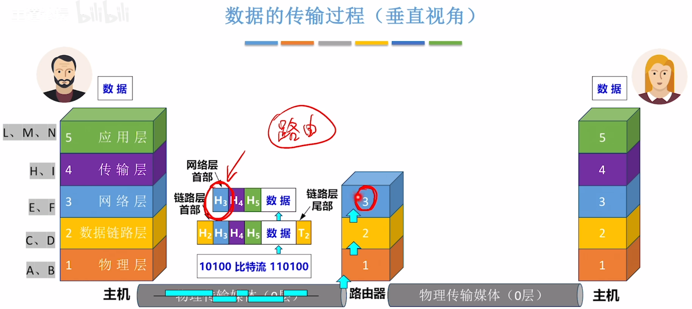
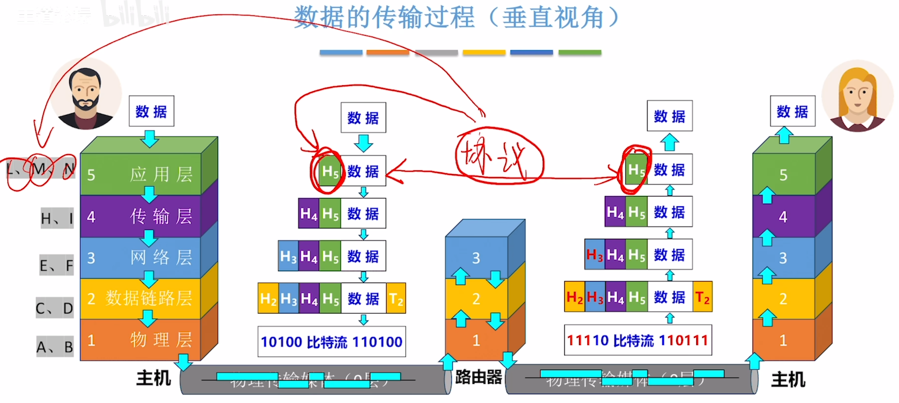
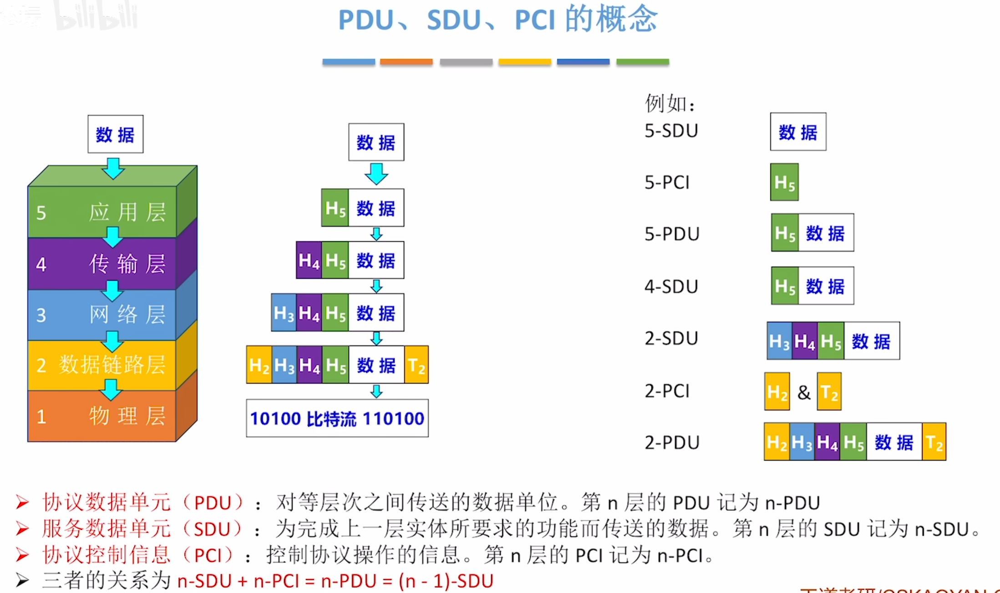
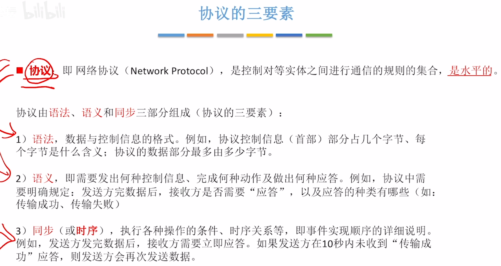

---
tags:
  - 计算机网络
---
# 三种常见的计算机网络体系结构

# 网络体系结构的概念

# 各层之间的关系

## 水平视角

>实体是在一层中的软件或硬件
>协议
## 垂直视角

>接口（服务访问点SAP）和服务

# 数据的传输过程
## 水平视角

>说明了协议的存在意义
>YSCS协议：
>发送方将数据压缩后，需要增加“首部”，说明采用
>了哪种压缩算法？
>接收方根据“首部”信息选择解压缩算法将数据解压
……其他规定……

## 垂直视角
数据从上往下发送

>无论首部还是尾部，最终都是为实现协议的功能而服务的

路由器接收到信息

>路由器的数据链路层检查链路层首部和尾部没问题后会把链路层首部和尾部拆掉

路由器发给下一个主机

# PDU,SDU,PCI的概念

>每一层的协议数据单元又会作为它下一层的服务数据单元

# 协议的三要素

