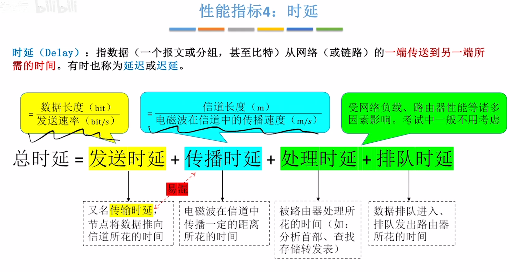
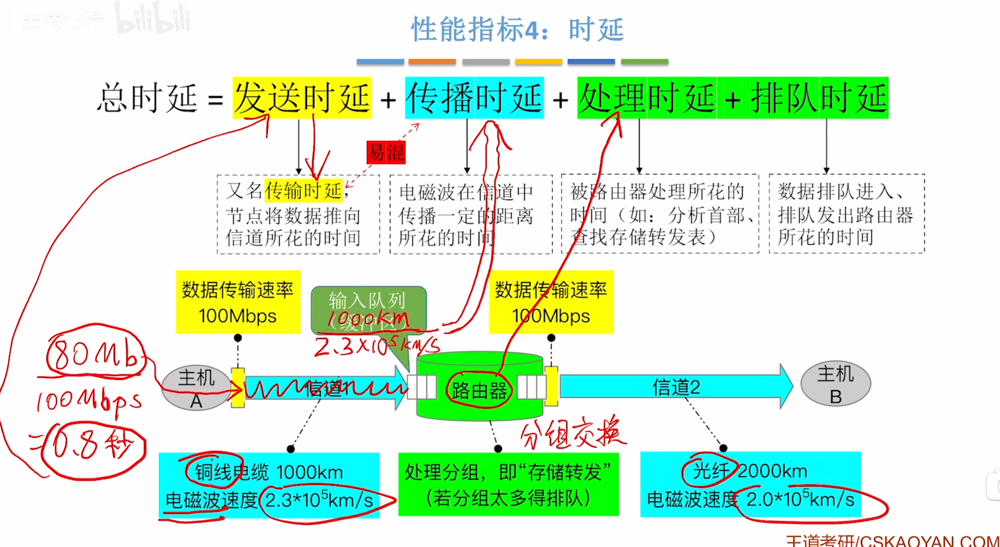
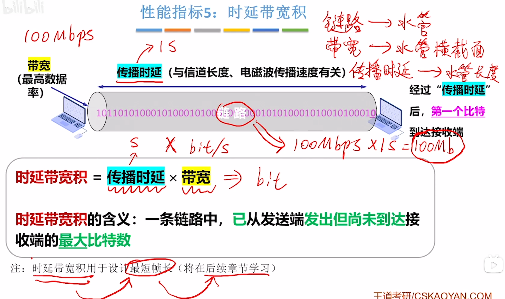
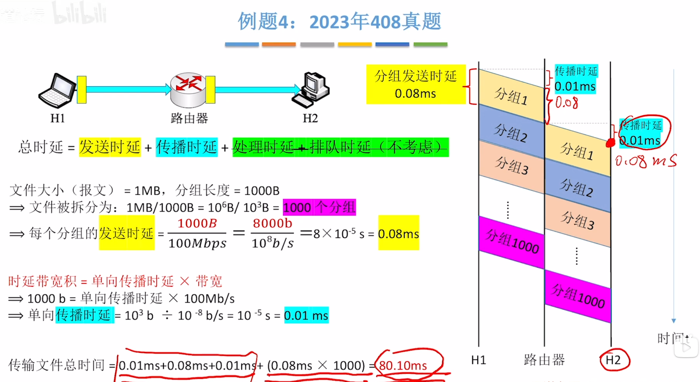
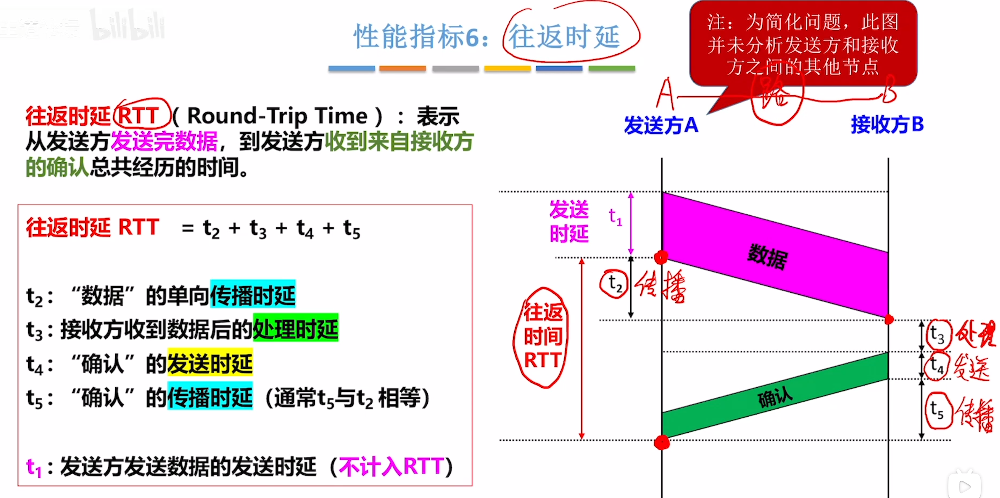

---
tags:
  - 计算机网络
---

# 速率

# 带宽

>
>带宽的另一种含义
>

# 吞吐量

# 时延

>
>每经过一条信道，就会产生一次发送时延和传播时延，每经过一个中间结点，就会产生一次处理时延和排队时延
>例题
>

# 时延带宽积

>例题
>
>从0.01+0.08+0.01这一时刻开始，H2每经过0.08ms则收到1个分组的数据

# 往返时延

