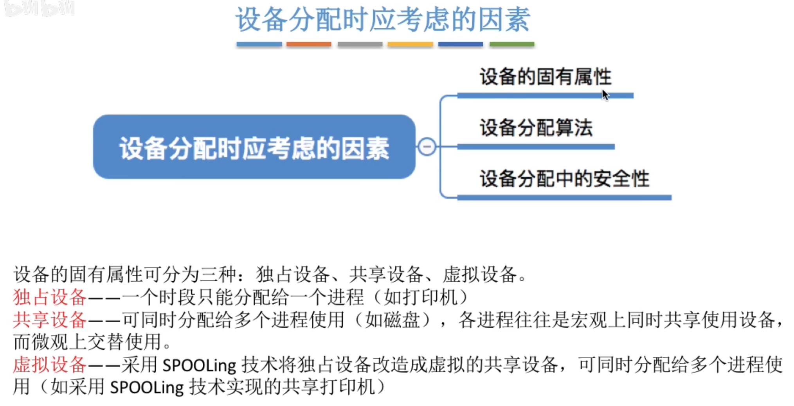
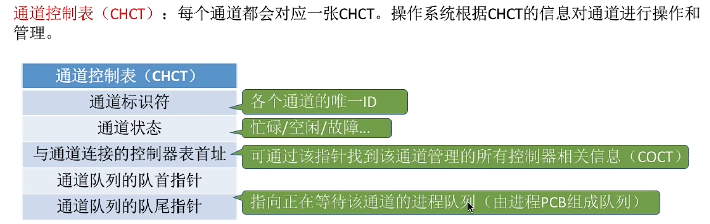

---
tags:
  - 操作系统
---
# 设备分配时应考虑的因素
## 固有属性

## 安全性

>[破坏请求和保持条件](408/死锁的处理策略.md#破坏请求和保持条件)

## 静态分配和动态分配
**静态分配**：进程运行前为其分配全部所需资源，运行结束后归还资源
破坏了“请求和保持”条件，不会发生死锁
**动态分配**：进程运行过程中动态申请设备资源

# 设备分配管理中的数据结构
## 设备控制表（DCT）

## 控制器控制表（COCT）

## 通道控制表（CHCT）

## 系统设备表（SDT）
