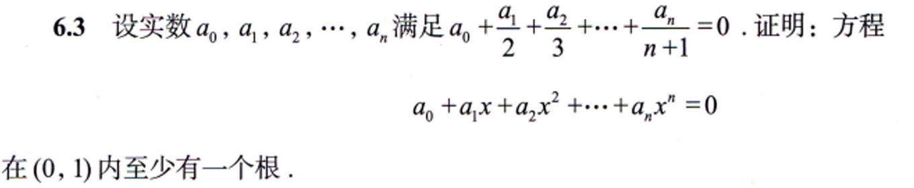
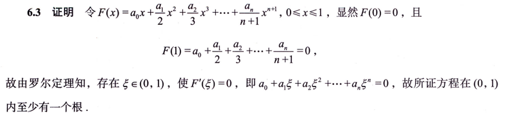

---
tags:
  - 罗尔定理
---
考虑一下几种方法
# 零点定理
# 函数性态[用函数性态证明不等式](微分不等式.md#用函数性态证明不等式)
# 罗尔定理
- 使用罗尔定理，通常需要[构造辅助函数](数学/构造辅助函数.md)。
## 30讲P182

这道题无论是零点定理还是函数形态都做不出来，此时就要考虑构造一个$F(x),且F'(x)=f(x)=a_0+a_1x+...$

