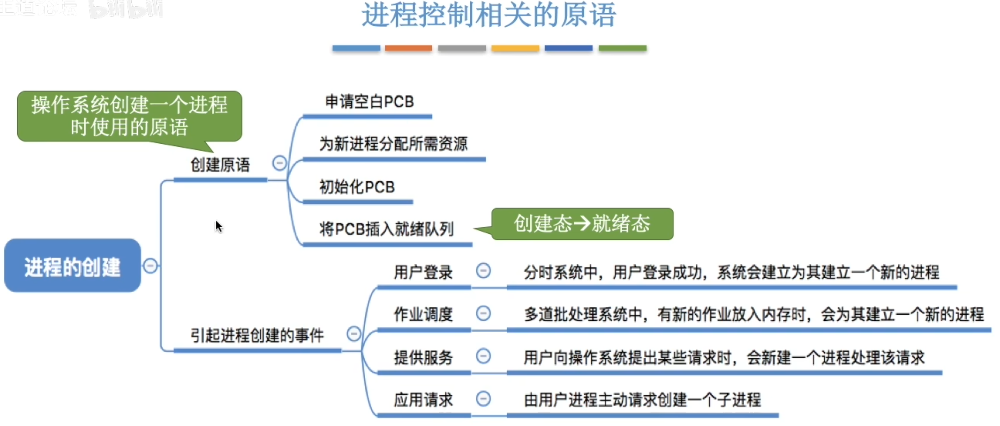
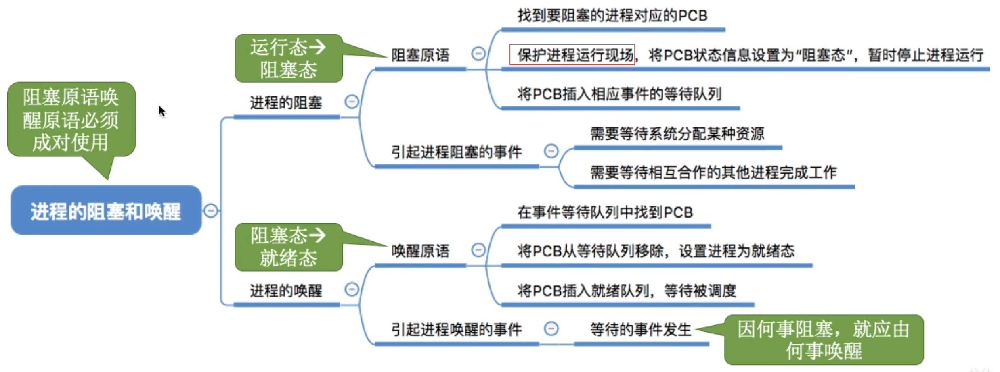
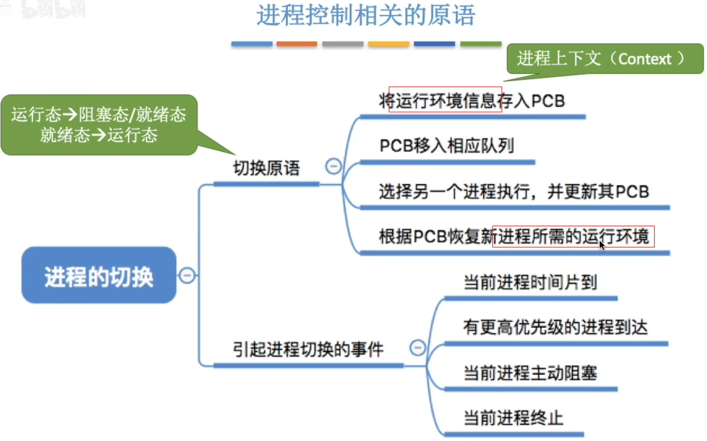
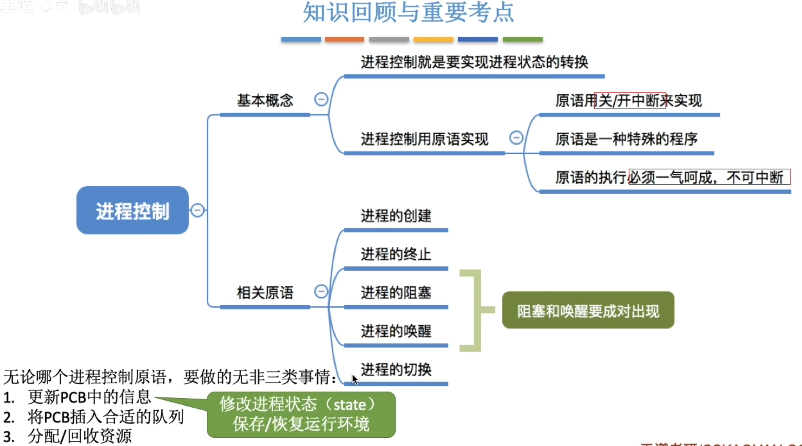

---
tags:
  - 操作系统
---
# 如何实现[进程状态的转换](进程状态的转换.md)
- 进程状态的转换需要一气呵成，不可被中断
- 使用**原语**来实现
- 可以通过**关中断指令和开中断指令**这两个特权指令实现原子性

# 进程控制相关的原语
## 进程的创建

## 进程的终止

## 进程的阻塞和唤醒

## 进程的切换

### 进程的运行环境

>进程的运行环境就是进程的运行过程当中，寄存器里存储的中间结果。当要切换进程时，这些寄存器原来存储的上一个进程的结果可能会被目前运行的进程的结果覆盖掉，所以需要PCB保存这个进程的运行环境

# 小结

