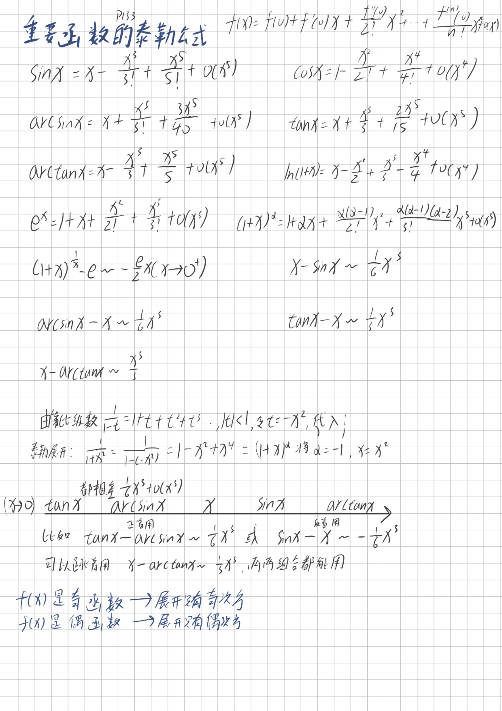
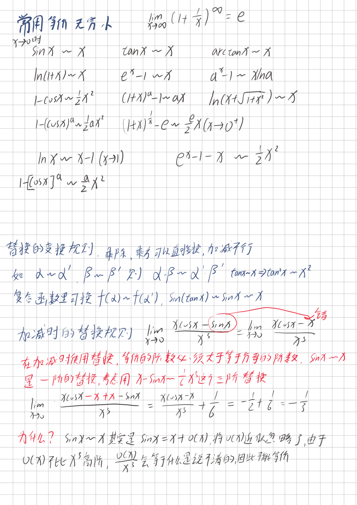
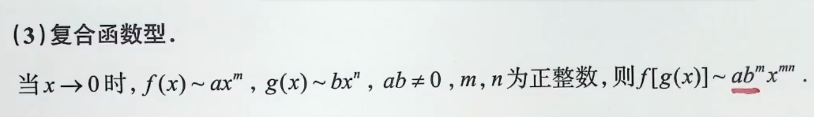

# 带拉格朗日余项的泰勒公式
- **设$f(x)$在$x_0$的某个==邻域==内n+1阶导数存在**，则对该领域内的任意点x，有
$$f(x)=f(x_0)+f'(x_0)(x-x_0)+...+\frac{1}{n!}f^{(n)}(x-x_0)^n+\frac{f^{(n+1)}(\xi)}{(n+1)!}(x-x_0)^{n+1}$$
- 此公式适用于区间\[a,b]当条件==给的是区间，考虑拉格朗日余项==
- $\xi在x_0与x之间$

## 泰勒公式带值
在证明题中

---

📝 泰勒公式：展开点 $x_0$ vs 代入点 $x$ 的区别

### 💡 核心原则

- **$x_0$ (展开中心)**：决定了导数项 $f^{(n)}(x_0)$ 的形式。**想要谁的导数，就在谁那里展开。**
- **$x$ (自变量/代入点)**：决定了 $(x-x_0)$ 的差值形式。题目给了哪点的函数值（如 $f(0), f(1)$），就把这点代进去。

---

### ⚙️ 二阶泰勒公式通用模板

$$ f(\color{blue}{\text{动点}}) = f(\color{red}{\text{定点}}) + f'(\color{red}{\text{定点}})(\color{blue}{\text{动}} - \color{red}{\text{定}}) + \frac{f''(\xi)}{2}(\color{blue}{\text{动}} - \color{red}{\text{定}})^2 $$

> [!NOTE] 记忆口诀 **定点**出导数，**动点**做差值。

---

### 🆚 场景对比举例

### 场景 A：在固定点 $x_0$ 展开（求近似值/极限）

**目标**：利用已知点 $x_0=1$ 的信息，去估算附近点 $x$ 的值。

- **设定**：展开点 $\color{red}{x_0 = 1}$，代入点 $\color{blue}{x}$ (任意)。
- **写法**： $$ f(x) = f(1) + f'(1)(x-1) + \frac{f''(\xi)}{2}(x-1)^2 $$
- **特征**：导数项是常数 $f'(1)$，变量 $x$ 留在式子里。

### 场景 B：在动点 $x$ 展开（证明题常用）

**目标**：证明关于任意点 $x$ 的导数性质（如你图片中的例题）。

- **设定**：展开点 $\color{red}{x_0 = x}$ (我们要研究的点)，代入点 $\color{blue}{0}$ 和 $\color{blue}{1}$ (题目给的端点)。
- **写法**：
    1. **代入 0**： $$ f(0) = f(x) + f'(x)(0-x) + \frac{f''(\xi_1)}{2}(0-x)^2 $$
    2. **代入 1**： $$ f(1) = f(x) + f'(x)(1-x) + \frac{f''(\xi_2)}{2}(1-x)^2 $$
- **特征**：导数项变成了我们要证的 $f'(x)$，具体的数值 $0, 1$ 被代入了差值项。

---

在考研证明题中，如果结论涉及 **任意点 $x$ 的导数 $f'(x)$**：

1. 必须把 **$x$ 当作 $x_0$** (展开中心)，这样 $f'(x)$ 才会出现在一阶项系数里。
2. 必须把 **端点 (0, 1) 当作 $x$** (代入点)，这样才能利用 $f(0)=f(1)$ 消去 $f(x)$ 项，从而解出 $f'(x)$。

## 泰勒公式的展开原则
- p52
# 带佩亚诺余项的n阶泰勒公式
- 设$f(x)$在==点$x_0$处n阶可导==，则存在$x_0$的一个邻域，对于该邻域内的任意点x,有$$f(x)=f(x_0)+f'(x_0)(x-x_0)+...+\frac{1}{n!}f^{(n)}(x-x_0)^n+o((x-x_0)^n)$$

# 重要函数的泰勒公式
[常用泰勒公式](常用泰勒公式.md)

$$ \left[\ln\left(x+\sqrt{x^2+1}\right)\right] = x-\frac 1 6 x^3 + o(x^3) $$
$$x\to 0,(1+x)^{\frac 1 x}=e[1-\frac x 2 + \frac{11}{24}x^2+O(x^2)]$$
# 常用等价无穷小替换
18讲p4,（还有变上限积分型）

>两个重要极限P53
>$e^x - 1 - x 等价于 \frac 1 2 x^2$ 
>$x-ln(1+x)等价于\frac 1 2 x^2$

## 复合函数的等价

复合函数的阶数就等于内层函数的等价无穷小阶数乘以外层函数的等价无穷小阶数

## [变限积分等价](变限积分性质.md#变限积分等价)
找到积分内的阶数，积分内的阶数是m，积分上限的阶数是n，那么总阶数就是$(m+1)\times n$